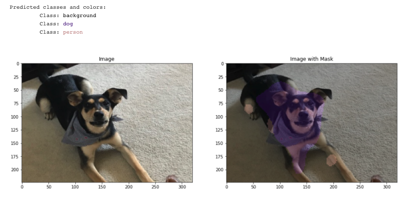

# ResNetFCN
A tf2 implementation of a FCN (using a ResNet for transfer learning) over the VOC 2012 dataset.

# Steps to Use
1. Run DataPrep.ipynb (Downloads VOC 2012 dataset and makes tf.Record dataset).
2. Run ModelPrep.ipynb (Declares ResNetFCN, trains model, and converts to tf.lite model).
3. Run Inference.ipynb (Infer test image with ResNetFCN, outputs test image with labeled/colored mask).

# Train model not in notebook
If you need to train the model not in a jupyter notebook (for example, on a remote server),
the model can be trained by running train_model.py.

# File structure
File structure used for project.
``` bash
.
├── DataPrep.ipynb
├── Inference.ipynb
├── ModelPrep.ipynb
├── ResNetFCN_VOC2012.h5
├── VOCdevkit.zip
├── f16_lite_model
│   └── ResNetFCN_VOC2012_f16.tflite
├── test_pic.jpg
├── tfData
│   ├── train_record.tfrecords
│   └── val_record.tfrecords
└── train_model.py
```

# Sample prediction

